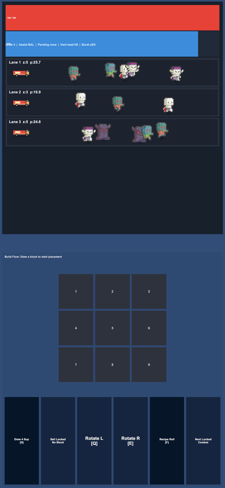

# Prototype Play Mode Review Pack

Generated: 2026-05-27 00:26 KST
Review readiness: `partial_evidence`
Visual review required: `True`

## Machine Summary
- Suite status: `manual_partial` (1/4)
- Suite evidence source: `manual screenshot registration`
- Screenshot status: `partial` (2/2 quality pass)
- Unlabeled screenshots: `0`
- Manual registration candidates: `0`
- Triaged non-state screenshots: `1`
- Manual record status: `not_recorded`
- Asset status: `ok`, planned missing: `14`
- Wave Combat action showcase: `False` (legacy_wave_combat_capture_without_attack_labels)
- Missing labeled states: Draw Choice, Pending Placement, Invalid Placement

## Planned Resource Backlog
These missing planned resources are not runtime blockers. Use them to separate feedback polish from Play Mode readability failures.
| Category | Resource | Intended role |
| --- | --- | --- |
| planned_feedback | `Assets\Resources\FoodTruckPrototype\VFX\attack_source_trail.png` | Future 256x256 transparent PNG or sprite-sheet frame set. Keep no embedded text so labels can stay localized/readable. |
| planned_feedback | `Assets\Resources\FoodTruckPrototype\VFX\hit_impact_pop.png` | Future 256x256 transparent PNG or sprite-sheet frame set. Keep no embedded text so labels can stay localized/readable. |
| planned_feedback | `Assets\Resources\FoodTruckPrototype\VFX\lane_leak_warning.png` | Future 256x256 transparent PNG or sprite-sheet frame set. Keep no embedded text so labels can stay localized/readable. |
| planned_feedback | `Assets\Resources\FoodTruckPrototype\VFX\release_reward_pulse.png` | Future 256x256 transparent PNG or sprite-sheet frame set. Keep no embedded text so labels can stay localized/readable. |
| planned_feedback | `Assets\Resources\FoodTruckPrototype\VFX\wave_payoff_pulse.png` | Future 256x256 transparent PNG or sprite-sheet frame set. Keep no embedded text so labels can stay localized/readable. |
| planned_audio | `Assets\Resources\FoodTruckPrototype\Audio\placement_success.wav` | Short WAV, normalized for UI/gameplay clarity; map each cue to a named rhythm beat. |
| planned_audio | `Assets\Resources\FoodTruckPrototype\Audio\placement_fail.wav` | Short WAV, normalized for UI/gameplay clarity; map each cue to a named rhythm beat. |
| planned_audio | `Assets\Resources\FoodTruckPrototype\Audio\wave_start.wav` | Short WAV, normalized for UI/gameplay clarity; map each cue to a named rhythm beat. |
| planned_audio | `Assets\Resources\FoodTruckPrototype\Audio\heat_warning.wav` | Short WAV, normalized for UI/gameplay clarity; map each cue to a named rhythm beat. |
| planned_audio | `Assets\Resources\FoodTruckPrototype\Audio\overheat_spike.wav` | Short WAV, normalized for UI/gameplay clarity; map each cue to a named rhythm beat. |
| planned_audio | `Assets\Resources\FoodTruckPrototype\Audio\combo_ready.wav` | Short WAV, normalized for UI/gameplay clarity; map each cue to a named rhythm beat. |
| planned_audio | `Assets\Resources\FoodTruckPrototype\Audio\recipe_activate.wav` | Short WAV, normalized for UI/gameplay clarity; map each cue to a named rhythm beat. |
| planned_audio | `Assets\Resources\FoodTruckPrototype\Audio\release_reward.wav` | Short WAV, normalized for UI/gameplay clarity; map each cue to a named rhythm beat. |
| planned_audio | `Assets\Resources\FoodTruckPrototype\Audio\wave_payoff.wav` | Short WAV, normalized for UI/gameplay clarity; map each cue to a named rhythm beat. |

## State Review Table
| State | Evidence | Current record | Visual decision |
| --- | --- | --- | --- |
| Draw Choice | missing | `NOT_RECORDED` | PASS / FIX_LAYOUT / FIX_ASSET / FIX_FEEDBACK / BLOCKED |
| Pending Placement | missing | `NOT_RECORDED` | PASS / FIX_LAYOUT / FIX_ASSET / FIX_FEEDBACK / BLOCKED |
| Invalid Placement | missing | `NOT_RECORDED` | PASS / FIX_LAYOUT / FIX_ASSET / FIX_FEEDBACK / BLOCKED |
| Wave Combat | suite: PlayModeScreenshots/foodtruck-playmode-20260504-010153.png | `PASS` | PASS / FIX_LAYOUT / FIX_ASSET / FIX_FEEDBACK / BLOCKED |

## Screenshot Contact Sheet
### Wave Combat
- Quality: `True`, size: `1170x2532`, bytes: `119229`


### Triaged Non-State
- Quality: `True`, size: `1170x2532`, bytes: `114110`


## Visual Acceptance Checklist
| State | Must see in screenshot | Record as FIX when missing |
| --- | --- | --- |
| Draw Choice | Three comparable cards with shape, ingredient, value/risk, `Fit`, `Heat`, and `Role` visible. | `FIX_LAYOUT` if clipped or overlapping; `FIX_FEEDBACK` if the choice tradeoff is unclear. |
| Pending Placement | Pending block, 3x3 board, recommendation reason, rotation, and next action are readable. | `FIX_LAYOUT` if board/controls crowd the battlefield; `FIX_FEEDBACK` if the next action is unclear. |
| Invalid Placement | Blocked reason and `Next` recovery hint appear near the board/cue. | `FIX_FEEDBACK` if the reason or recovery hint is missing. |
| Wave Combat | Battlefield takes over half the screen, one long truck is visible, enemies/lane pressure are readable, and action labels `-12`, `KO`, `LEAK`, `TRUCK -7` plus lane flash are visible. | `FIX_LAYOUT` if the battlefield is crowded; `FIX_FEEDBACK` if action labels or payoff cues are missing. |

## Manual Evidence Registration Hints
No unlabeled machine-quality PNG candidates are available for manual registration.

## Triaged Non-State Screenshots
- `Docs\PlayModeScreenshots\foodtruck-playmode-20260504-010245.png`: Build Flow idle screenshot; it does not show 3 Draw Choice cards, a pending block, or invalid placement feedback.

## Recommended Result Commands
All PASS after visual review:
```powershell
powershell -ExecutionPolicy Bypass -File "Tools\Write-PrototypePlayModeResultFromSuite.ps1" -ProjectPath "D:\uni\zombieFoodcenter" -DrawChoice PASS -PendingPlacement PASS -InvalidPlacement PASS -WaveCombat PASS -Apply
```
Example FIX result:
```powershell
powershell -ExecutionPolicy Bypass -File "Tools\Write-PrototypePlayModeResultFromSuite.ps1" -ProjectPath "D:\uni\zombieFoodcenter" -DrawChoice PASS -PendingPlacement FIX_LAYOUT -InvalidPlacement FIX_FEEDBACK -WaveCombat PASS -Apply
```
After applying a result:
```powershell
powershell -ExecutionPolicy Bypass -File "Tools\Verify-PrototypePlayModeRecord.ps1" -ProjectPath "D:\uni\zombieFoodcenter" -JsonOnly
```

Note: this review pack organizes evidence only. It does not replace visual PASS/FIX/BLOCKED judgment.
